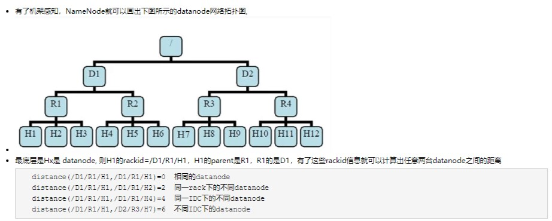
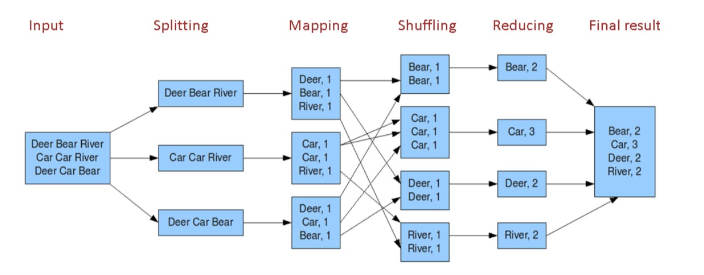
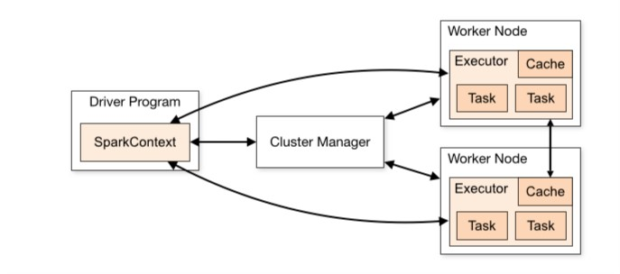
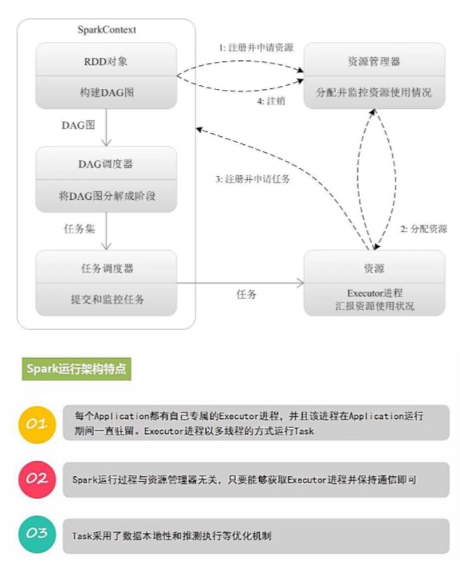

# Overview
## HDFS (file system)
NameNode and DataNode
### General info of HDFS
data block is 64M. (write once, read multi times)
Relative： umask（the one taken out by defualt setting in terms of permission）
Relative: Sticky bit(protect itself being wrongly deleted by other user)
### Staging
```
1. client will cash the temp file write request beforing reaching data block 
2. client contact namenode and request a datanode location. 
3. namenode schedule so. and return datanode id, target datablock to client
4. client write content in temp file to allocated datanode and close file. 
5. client notice namenode that file closed. 
6. namenode log so. (notice if namenode down before file close, then file in block will be lost, this is due design consideration on e.g. performance or so)
```
* Pipeline copy to replica copy on other node. e.g. 4k on time from copy 1 to copy 2 then copy 2 to copy 3. 
 
### Replica location stategy
default replica numer is 3 
general logic is:
```
1. first replica is on a node of same rack with original record
2. second replica is on a node of differnt rack than step 1
3. third replica is on different node of step 2 rack
```
by default rack awareness is not enabled. and that will go to /default-rack
### Rack awareness 
```
configuration entry in core-site.xml
<property>
  <name>net.topology.script.file.name</name>
  <value>/etc/hadoop/conf/topology_script.py</value>
</property>
example topology script at https://cwiki.apache.org/confluence/display/HADOOP2/Topology+rack+awareness+scripts
idea is like to get arranged rack for different node. otherwise goes to /default/rack.
e.g. input is ID and output is the rackID on that node. 
```

### EditLog, FsImage and checkpoint
 * EditLog: log to chang on HDFS file system. (namenode stoer this editLog in namenode local OS)
 * FsImage： filesystem namespace, mapping from file to datablock
 * checkpoint: namenode keep whole filesystem namespace mapping to blockmap. when namenode starting, it will apply operaiotn logged through Editlog on that time FsImage. then persiste new updated FsImage from in-memory to Local FS. and remove old EditLog.
```
kind of like system snapshot sampling. and EditLog with FsImage is the one used to back-tracking the system change. 
```
### Availiblity, Rubostness, Health-checking(self-monitoring), cluster load balance
* Heartbeast from Datanode to Namenode, in case no heartbeat from datanode, namenode will mark it down and trigger datablock copy. (e.g. datanode lost, replica corrupted, available replica under threshhold）
* integrity check through checksum 
* cluster data re-balance 
* avoid single point of failure

## Map-reduce

## YARN
ResourceManager, NodeManager, ApplicationManager, Container
scheduler strategy: FIFO, FAIR, 
## MapReduce
## ZooKeeper
## Hive (sql like client)
## HBASE (distributed Database)
## Spark
It is a framework, toolset, facility provider that supports batch, streaming, interactive operation mode. 
### RDD(Resilient Distributed Dataset) 
it's read-only, distributed in cluster, re-used and in-memory data abstration type for computing operaiton. 
#### RDD Supported Operations:
  * Transformation： that is lazy loading kind. (map, flatmap, filter, distinct, union, intersection, subtract, cartesian
  * action： understand that RDD init and execution really happens. (collect, count, countByKey, take, top, reduce, fold, foreach, saveAsTextFile, saveAsSequenceFile)
#### RDD Lineage 
RDD can be re-built in failure or exception case based on its lineage. 
  * narrow dependency: 1 to 1 in terms of parent RDD being transformed to child RDD
  * wide dependency: 1 parent RDD may be used/transformed to many child RDD
Submission, Job, DAG, Stage

Design of RDD is rooted from concept that moving computing task to node. (cause RDD can be re-built based on DAG)
#### Shuffle
when that operaiton would need more partition to be invovled rather than it's ok to performing on single partitoin alone. in that case, Spark need a all-to-all operation. that's shuffle.
  * normally repartion operation like repartition , coalesce, byKey operation like groupByKey, reduceByKey and join oepraiton like cogroup, join
### Spark inside
* RDD as above
* DAG: Directed Acyclic Graph (reflect lineage of RDD)
* Driver program: take applicaiton and generate DAG. (once got executor allocated on node. driver program must also listen and accept incoming connection from its executor through its lifetime. and considering exectutors stays with its application the whole time. then it mean all and forever till stop)
* cluster manager: e.g. YARN or Mesos
* worknode: as it is 
* executor: process in worknode. running different kind of task and data.(spark also sends application coe(jar or py) to executors.
* Application: user developed application, one application is formed of multi job
* job:  one job is of multi RDD and operaiton/transformation on it. (like the work you want to do, e.g. wordcount)
* stage: one job can be running in several stages. one stage can be several tasks
* Task: running by executor. (thread of executor) 
Note: Stage is the one scheduled when running one job
#### Spark running architect

#### Spark job execution 

## Hadoop start-all.sh can't have datanode 
root cause: the cluster id is different if you compare data/current/VERSION and name/current/VERSION. 
fix: copy clusterid in name/current/VERSION to /data/current/VERSION 
it's caused by running format twice or several times. 
to locate VERSION file. 
```
1. find it in core-default.xml where those info are recorded as configuraiton when starting HADOOP
2. find / -name VERSION -print|grep -i current
```


