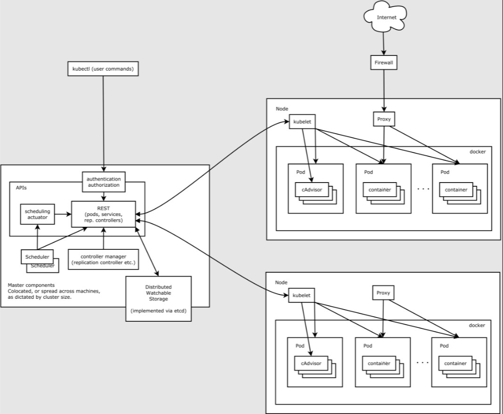
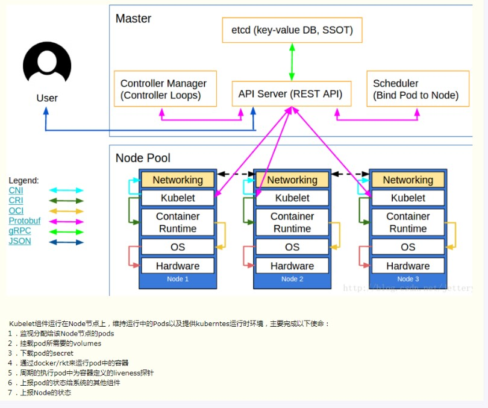
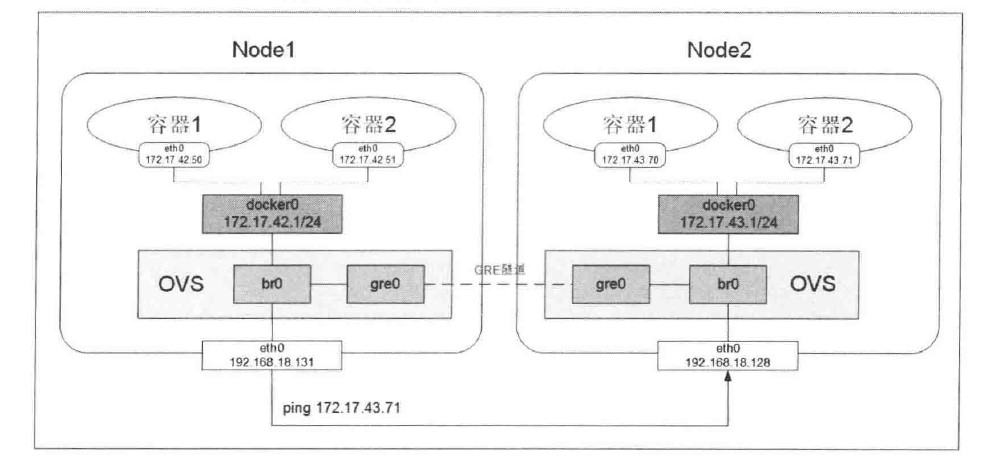
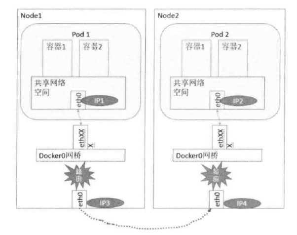
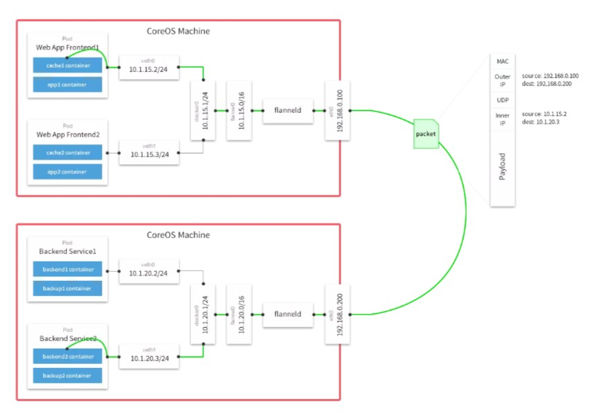

# Kubernetes
## concept
PaaS kind providing cluster management, A&A, mutlti-tenant, service registration/discovery, load balance, self-monitoring/healing, rolling upgrade and scalling out, scheduling.
```
Management Concept
*Service(label, cluster ip)
*pod(pause container and business container, sharing volume and network) 
*node(control node, edge node, worker node, carrying different kind of role and pods)
	* control node : apiserver, controller-manager, scheduler 
	* worker node: kubectl, kube-proxy
	
Deployment Conencept
	*RC
	*Deployment
	*service
```
### kubernete yaml development e.g. writing service, pod, deployments
```
1. kubectl api-resources
2. kubectl explain deployments or kubectl explain deployments.metadata or kubectl explain deployments --recursive
eg.  kubectl get replicasets <name> -n <namespace> -o yaml 
```
### Concept:Node
```
* This is coming from e.g. OpenStack or other VIM managed resource, registered to Kubernetes node controller by telling trhough kubectl. 
* kubectl, kube-proxy, docerk-daemon running on top. 
* Status: Pending, Running, Terminated
```
### Concept: Pod
```
1. container insider pod share IPC, Volumes, PID, Network, UTS
2. RestartPolicy: Always, OnFailure, Never
```
### Concept: Labels
link things. used internally by kubernetes to link service to pod, affinity rule. node selector etc. 
### Concept: Service
service cluster IP is not changed but only for internal use. 
service provides external access thorugh NodePort or LoadBalancer
in practice, once receiving Service creation request. there will be Endpoint(ip+port) created for that service with same name, that will link to selected out pods through label selector. 
Kubernetes support TCP and UDP to access those POD. 
### Volume 
```
lifecycle is with pod.
* EmptyDir
* hostPath (in host machine)
* gcePersistentDisk
* awsElasticBlockStore
* nfs
* iscsi
* glusterfs
* rdb
* gitRepo
* secret
* persistentVolumeClaim (PV) 
```
## architecture

and 

```
Example of creating service/pod 
1. develop replicaset and apply kubectl create -f <rc.yaml> 
	2.1 API Server create record to ETCD 
	2.2 controler manager monitor this change thorugh API server, find out there is no pod for that then create pod object according to RC template 
	2.3 scheduler find this pod object creation activity. schdule it to right node per algorithm, writing record to etcd through API server 
	2.4 kubelet on target Node get this order and create pod as well as taking care of its lifecycle.
3. develop service and apply kubectl create -f <svc.yaml>
	4.1 API server receive service to POD link request
	4.2 Controller manager query and generate service endpoint, write to etcd through API server 
	4.3 Proxy on Node get this change and create mapping/routing through lb.
```
```
component role: 
* API Server: CRUD and change notice
* Controller manager: workhourse and controller 
	* Replication Controller
	* Node Controller
	* ResourceQuota Controller
	* Namespace Controller
	* ServiceAccount Controller
	* Token Controller
	* Service Controller
	* Endpoint Controller
			
* Scheduler: as it is 
	* some strategy: e.g. NoDiskConflict, PodFitsResources, PodSelectorMatches, PodFitHost, CheckNodeLabelPresence, and so on. 
* kubelet: taking care of POD LCM
* Proxy: service proxy and request routing 
* etcd: service registry/discovery/other usrage e.g. subscribe&notice 
```
## Pod Health Check
```
* LivenessProbe
	*ExecAction
	*HTTPGetAction
	*TCPSocketAction
* ReadinessProbe
```
## Authenticaiton & Authorization
```
Authenticaiton: CA, Token, HTTPBasic
Authorization: AlwaysDeny, AlwaysAllow, ABAC(Attribute Based Access Control)
*ABAC (user, readonly, resource, namespace as attributes of strategy object)
	*e.g. some authorization json. 
	{"user":"eric"}    eric is allowed to do anything 
	{"user":"eric","resource":"pods","readonly":true} eric is allowed to read all pods info
```
## secret
```
used for password, token, key etc. 
* Opaque : base64
	* echo -n "amdin"|base64
	* echo "<encrypted string>"|base64 --decode
* Service Account : access API server 
* kubernetes.io/dockerconfigjson : docker registry a&a info
```
```
1. kubectl get secret #get listed secret
2. kubectl get secret <name> -o jsonpath='{.data}'
3. echo "<******>" |base64 --decode  #<****> is the one in step2
```
## network
principle: Flat network in kubernetes
```
1. pod can communicate with other pod without NAT
2. pod can communicate with other pod(not in same host) without NAT
3. ip+port is same from pod external/internal view. 
```
### Docker network model
```
1. kernel level network space isolation. (own iptables/netfilter to set up fw, nat rule etc)
2. veth device to connect different network namespace.(ip link show)
3. bridge, route, iptabel/netfilter (ip route list)
Docker network model: Host, None, Bridge, container. normally it's bridge: docker0
```
(communication accross host, requires Plugin) /overlay 
### Docker CNI
### kubernetes network 
```
1. scope of docker0 ip range on diffrent node(global unique)
2. pod ip to node ip mapping
#Plugin e.g. calico, flannel(overlay). etc.
kube-proxy takes care of routing and Load balanace (e.g .RR or session affinity)
```
pod to servie
```
1. kube-proxy takes care of clusterip:port to pod behind service (create iptables rule per service dynamically)
```
### kubernetes network plugin
	* flannel (flannel0 on top of docker0, overaly) 
	* calico (tier3 network, Felix, BGP client)
	* ovs (bridge gr0 to connect docker0 on different node)	
	* direct routing(docker0 to docker0 on other node)
	```
	ifconfig docker0 10.1.10.1/24
	route add -net 10.1.20.0 netmask 255.255.255.0 gw 192.168.1.129
	route add -net 10.1.10.0 netmask 255.255.255.0 gw 192.168.1.128
	route -n #check the routing rule
	```
Pic to show helicoptor's view
#### OVS

#### Direct Routing

#### Flannel 

## Kubernetes API
REST 4 Levels defination
```
Resource model
use HTTP GET, PUT, POST, PATCH 
status code:
	* 1** process info
	* 2** success
	* 3** redirection
	* 4** client side error
	* 5** server side error
```
## Kubernetes cluster management and Maintenance
### node isolation
```
1. first set node to unschedule 
kubectl patch node <node name> -p '{"spec":{"unschedulable":true}}'
2. stop pod on it
3. set back 
kubectl patch node <node name> -p '{"spec":{"unschedulable":false}}'
```
### node scale-out (kubelet, kube-proxy)
### pod scale-out
```
kubectl scale rc <rc name> --replicas=3
```
### Label resource
```
kubectl label pod <pod name> role=backend
kubectl get pod <pod name> -n <namespace> --show-labels
```
### Global Limit
e.g. use Kind:LimitRange to limit all pod resource requirements. 
```
apiVersion: v1
kind: LimitRange
metadata: limit-range-1
spec:
  limits: 
    - type: "Pod"
      max:
        cpu: "2"
	memory: 1Gi
      min:
        cpu: 250m
	memory: 32Mi
kubectl replace -f pod-container-limits.yaml 

```


## command & Tips

1. kubectl apply -f **.yaml
2. kubectl expose pod green -port 8080 --name blue-green  (service to outside)
3. kubect get service -n **
4. Ingress to config proxy 
	- routing on path pattern
	- kubectl apply -f ingress.yaml 
5. kubectl get pod ** -o yaml (to export spec of that pod)
6. kubectl explain pod 
7. kubectl port-forward <pod name> 8080:8081
8. kubectl logs pod
9. kubectl top pods  <check the status like top in linux> 
10. kubectl diff -f *.yaml 
11. kubectl api-resources |grep batch 
12. kubectl delete -f *.yaml <to delete that pod>
13. job run onetime e.g. restartPolicy is never 
14. kubectl logs <job name>
15. cronjob as one of kube resources or type
16. kubectl get endpoints  (service expose endpoint to outside world and enpoint only expose when it's ready for outside invocation) 
17. core numer * 1000 is the limite, e.g. 2 Core then the limit is 2000m
	if in one Container the limite is set as 2000m then that means it will require all 2 cores. 	
18. DRY-Don't Repeat yourself
19. helm template -f value.yaml .
20. helm history <** name>
21. kubectl debug <pod name> --attach
22. kubectl run -ti net-debug --image=nixery.dev/shell/curl/wget/htop /bin/bash
23. kubectl sniff <pod name>  (wireshark traffic of that pod)
24. kubectl scale rc <name> --replicas=3 
25. kubectl get pods --all-namespaces -o wide
```
